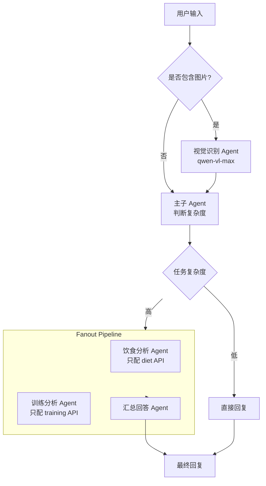

# Agent Pipeline 设计方案

## 流程图



## 组件说明

### 1. 视觉识别 Agent (Vision Agent)
- **模型**: `qwen-vl-max`
- **职责**: 分析用户上传的图片（如动作姿势、食物照片、健康记录截图）
- **输入**: 用户消息 + 图片
- **输出**: 图片的文字描述
- **工具**: 无（仅图片理解能力）

### 2. 主子 Agent (Main Agent)
- **模型**: `qwen-max`
- **职责**: 
  - 接收视觉 Agent 输出或纯文本用户输入
  - 判断任务复杂度（简单问题直接回答 / 复杂问题触发分析）
  - 拥有所有基础工具
- **输出**: 直接回复 或 触发 Fanout Pipeline

### 3. 饮食分析 Agent (Diet Analysis Agent)
- **模型**: `qwen-max`
- **职责**: 根据「主子 Agent」拆解的子任务，分析饮食数据
- **工具**: 仅挂载 diet 相关 CLI 命令（`get-diet-*`, `search-foods`, `analyze-diet-gap` 等）

### 4. 训练分析 Agent (Training Analysis Agent)
- **模型**: `qwen-max`
- **职责**: 根据「主子 Agent」拆解的子任务，分析训练数据
- **工具**: 仅挂载 training 相关 CLI 命令（`get-training-*`, `get-exercise-*` 等）

### 5. 汇总回答 Agent (Summary Agent)
- **模型**: `qwen-max`
- **职责**: 汇总 Fanout Pipeline 中各 Agent 的输出，生成最终统一回复

## 数据流向

```
User Input → [Vision Agent (if image)] → Main Agent
  ├── Simple: Main Agent → Final Reply
  └── Complex: Main Agent → Fanout Pipeline
       ├── Diet Agent → Diet Result
       └── Training Agent → Training Result
       └── Summary Agent → Final Reply
```

## 配置变更

在 `agent.json` 中新增：

```json
{
  "pipeline": {
    "enabled": true,
    "vision_model": "qwen-vl-max",
    "reasoning_model": "qwen-max",
    "fanout_enabled": true,
    "fanout_agents": ["diet_analysis", "training_analysis"]
  }
}
```

## 复杂度判断 Prompt

主子 Agent 通过系统提示词中的规则判断复杂度：

```
## 任务复杂度判断

请根据用户问题判断是否需要触发深度分析 Pipeline：

- **简单任务**（直接回答）：问候、简单知识问答、单维度查询
- **复杂任务**（触发 Fanout）：需要综合分析多个维度（饮食+训练）、
  需要关联分析数据趋势、需要给出整合建议

如认为是复杂任务，请在回复中标注 `[COMPLEX]` 前缀，
代理层会根据此标记触发 Fanout Pipeline。
```
