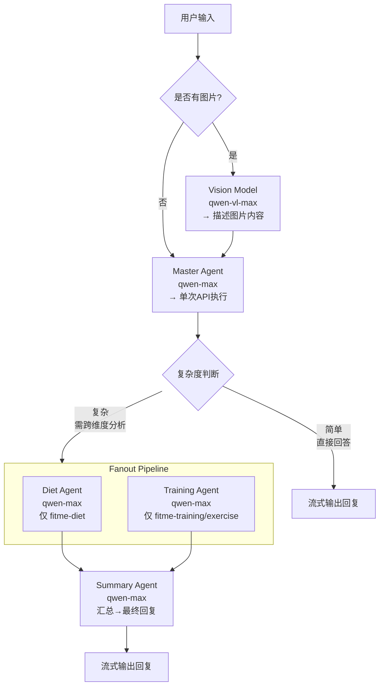

# Pipeline 工作流设计方案

## 架构



## 数据流

```
1. 用户消息 → VisionModel(qwen-vl-max)
   ↓ 
   图片描述文字 (如有)
   
2. 文字 + 原消息 → MasterAgent(qwen-max)
   ↓
   输出: 直接回复 或 {"action":"fanout","needs":["diet","training"]}

3. (可选) Fanout: 
   DietAgent(qwen-max) → 饮食分析报告
   TrainingAgent(qwen-max) → 训练分析报告
   
4. (可选) SummaryAgent(qwen-max):
   两张报告 → 整合回复
```

## 复杂度判断

Master Agent 通过 API 实际查询用户数据后决定：

```
## 复杂度判断规则

你负责决定是否需要触发深度分析。

1. 调用 fitme-diet / fitme-training 技能查询用户近期数据
2. 基于数据判断：
   - simple: 单维度查询/简单聊天 → 直接回复
   - complex: 需要综合分析/制定计划/跨维度 → 输出 JSON:
     ```pipeline
     {"action":"fanout","needs":["diet","training"]}
     ```
   然后停止当前回复，等待子 Agent 结果
```

## 模型配置

在 `agent.json` 中新增：

```json
{
  "pipeline": {
    "enabled": true,
    "vision_model": "qwen-vl-max",
    "reasoning_model": "qwen-max",
    "fanout_enabled": true
  }
}
```

## 与现有代码集成

1. `src/agents/config.py`: 新增 `PipelineConfig`，嵌入到 `AppConfig`
2. `src/agents/pipeline.py`: 新增 `PipelineController` 类，编排工作流
3. `src/agents/agent.py`: 新增 `create_main_agent`, `create_sub_agent`, `create_vision_agent`
4. `app/routers/agent.py`: `query_func` 接入 PipelineController
5. 用户可通过 Agent 配置页面开关复杂分析模式
